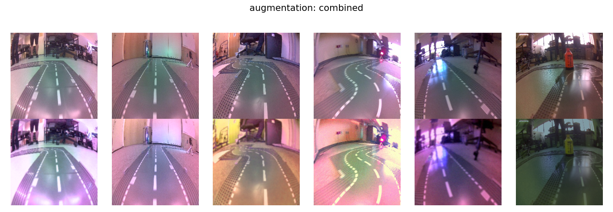
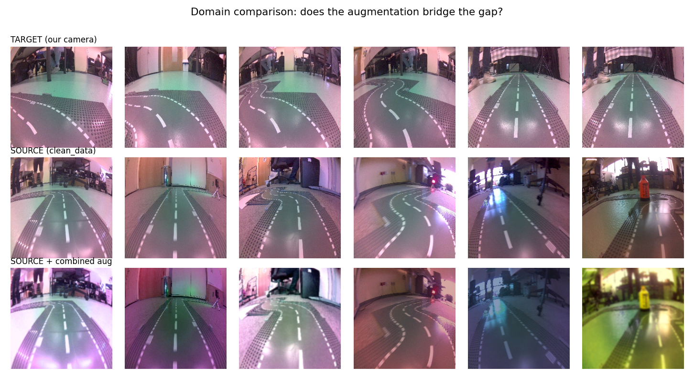
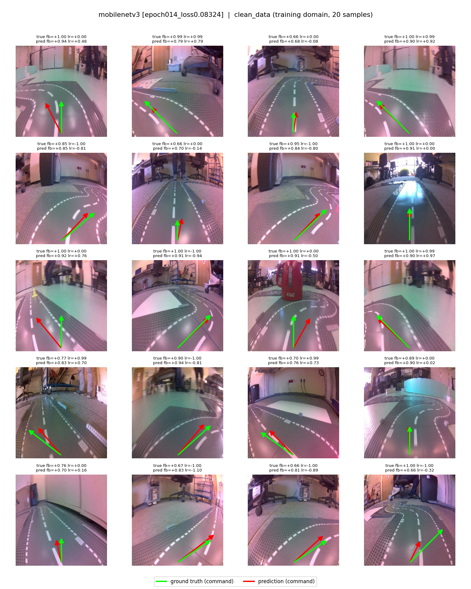
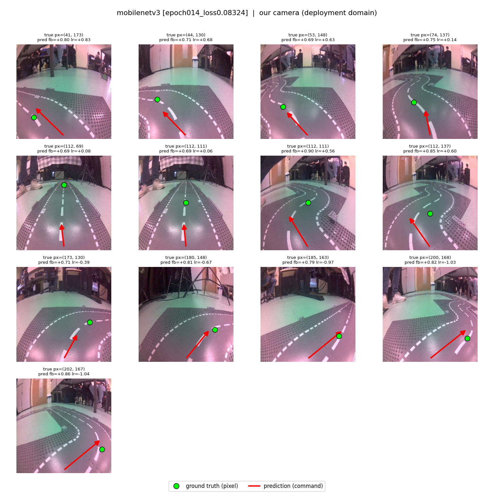

# JetBot End-to-End Road Following

Group name: Tweakers, Submission: 17.06.2026, GitHub repo: https://github.com/domhel/RoboticsII-Jetbot
Mukhammad Sattorov 159351, Hubert Nowakowski 160302, Dominik Helfenstein ER2224

The goal is to make a JetBot drive itself around a track using only its camera. A single neural network maps each camera frame directly to a driving command (forward/backward gain and left/right steering) with no hand-crafted lane detection or planning. The quality quality of the driving is therefore determined by the quality of the neural network as well as the post-processing of its outputs.

As will be seen, one challenge is a camera domain gap: the large labelled dataset was recorded with a different camera than the one on our robot, and the two cameras produce visibly different colors. This project bridges that gap so a model trained on the external data drives reliably on our own hardware.

---

## 1. Approach

To make the JetBot drive, a dataset is used and transformed to work with a training pipeline for a neural network. The neural network will receive images and provide control commands as outputs. For the neural network, two existing backbones will be used and compared, and a custom action-head as a last layer attached. The control commands will be post-processed and sent to the two actuators controlling the wheels. This results in an almost end-to-end AI-based architecture for autonomously driving the given race track.

## 2. Dataset

### 2.1 Overview

We use two datasets recorded on the same style of track but with different cameras:

| Dataset | Camera | Size | Role |
|---|---|---|---|
| External | other robot | ~7 600 frames | training |
| Ours | robot's camera | small hand-labelled set | deployment reference |

Each frame is labelled with the driving command the robot should issue at that moment (forward/backward speed, left/right steering), encoded directly in the data. The external set is hundreds of times larger, making it the only viable training source.

Examining the datasets reveals a difference in the colors that the cameras produce.  Measuring the average color of each dataset shows that our camera has a consistent magenta cast (raised red and blue relative to green), a systematic offset of roughly 8 % of the color range rather than random noise. A model trained naively on neutral external images would see an input it never encountered and steer poorly.

### 2.2 Image preprocessing trials

We decided to try multiple varying approaches and then mix and matched the best found results.

1) None:
As a baseline, we ran the training on just the dataset as it is, the results were poor and led us to trying different methods of preprocessing.

2) Black and white:
The initial idea was to turn it into black and white to avoid color issues. In our dataset, there was an overwhelming majority of samples that were captured in a slightly different environment than the performance test area. The black and white filter gave better results than no preprocessing.

3) ROI:
Another idea that we used was the usage of regions of interest (ROIs). We theorized that the effect of objects that should not affect the inference, especially those that were far beyond the road borders, could be minimized by simply cutting them off with an ROI. Although it did show better results in straight lines and entrance of turns, it suffered when the camera was already turning. The explanation we agreed upon was that due to the resizing that we had to do after the ROI, 2 different road shapes may end up looking too similar.

4) HSV filter
The roads had a white line in the center, if we were to be able to isolate them and only them, we could input the coordinates of the nearest white line as controls until we are above and then repeat the cycle. The main issue with this approach was the difficulty in tuning the hsv filters to properly detect and isolate ONLY the white lines. Furthermore, the difference in lights in different environments proved it to be an overly complicated matter with little gain.

5) Line isolating algorithms
We did not follow through much with any of the algorithms or filters that would isolate lines. Of course, it would prove to be helpful to find the borders of the road, average them to find the center line, and then break it into interval points' coordinates that get fed into the bot as inputs using a PID controller, but this is not the goal of this project.

Most of these methods were also paired with a contrast increase, a jitter function, and horizontal flips to decrease a specific turn bias.

Ultimately, we ended up augmenting the given dataset to align it more with our environment, which is described in the next section.

---

### 2.3 Augmentation

Rather than guess, we searched for an augmentation that reshapes the external images to cover our camera's color distribution. Candidate photometric augmentations were each scored on (a) how much of our camera's color range they reproduce and (b) how much color diversity they add.

| Augmentation | Covers our camera | color diversity |
|---|---|---|
| none (baseline) | partial | low |
| single effects (hue, blur, saturation, ...) | partial | low to medium |
| combined | full | highest |

The resulting augmentation is randomised color/brightness/contrast, hue and white-balance shifts, mild blur and sensor noise. Visually, the augmented external frames span the same range of color casts as our camera, including its magenta tint:

---

## 3. Model Architecture and Training

Two backbones were trained as steering regressors: ResNet-18 (given in the sample code) and MobileNetV3-Large. Both start from ImageNet-pretrained weights (transfer learning) and are fine-tuned to output the two driving commands, which is made possible by a 2 neuron fully-connected layer. ResNet-18 is a convolutional neural network with 18 layers and skip-connections. MobileNetV3-Large uses 16 layers, also with skip-connections and a mix of depthwise spatial filtering, pointwise expansion as well as projection.

The models are pretrained and fine-tuned with the augmented dataset.  The best model is saved whenever validation error improves, and every such improvement is archived as a separate snapshot to select a suitable model as overfitting appeared to be a problem. For every new loss minimum, some samples of the training dataset as well as the test dataset from our camera are fed through the network and visualized.

Validation error fell to around 9% for both backbones but had to be stopped early after 11 of 30 epochs for ResNet-18 and 14/50 epochs for MobileNetV3 with a cosine-scheduled learning rate starting at 1e-3.

---

## 4. Training Results

We evaluate by displaying the model's predicted driving command (red arrow) on sample frames. On the training-camera data the ground-truth command is known and shown as a green arrow. On our camera the labels are a point, so only the predicted command is shown.

For in-domain (training camera) images, predicted arrows align closely with the ground-truth arrows in direction and magnitude across straights and curves: the model reliably commands forward motion and steers toward the road. This confirms the task was learned correctly.

For cross-domain (our camera) images, despite the magenta cast, predictions stay sensible and stable: forward speed remains positive, and the steering consistently points the way the visible road bends: left on left-curving frames, right on right-curving ones, near-straight when the lane is centered. The color shift no longer confuses the model, which is required for the robot to follow the lane on its hardware.

---

## 5. Deployment

### 5.1 Inference and Driving

The trained model is exported to the ONNX format and run on the robot in a closed perception-action loop: capture frame -> predict command -> drive -> repeat. The same driving script supports either backbone, applying the matching image preparation so models behave identically on the robot and in our offline checks.

The driving script exposes post-processed controls instead of feeding raw predictions to the motors because the neural network may produce high-frequency control changes (or jitter) which would negatively influence the robot's stability.

The following options are available for the driving script:

- an optional constant, lower speed so only steering is enabled which is easier for initial testing
- separate gain and limits on speed and steering
- command smoothing to reduce jitter via exponential moving average (finally not used)
- automatic slow-down in sharp turns depending on the steer value (finally not used)

### 5.2 Error analysis

After deploying the trained models and running the driving scripts, it becomes apparent that the robot is not able to drive the lap autonomously. As section 4 has shown, the model's outputs are as expected, which means that other factors are an issue.

Error sources are 
(a) post-processing of the control-commands received by the neural network. The right values for forward- and steer-signal gain need to be found and fine-tuned.
(b) latency from the moment of capturing an image until controlling the robot, which also determines the control frequency. A low perception-action-loop frequency will lead to unresponsive control and abrubtly changing the steering if the velocity is too high. We have noticed that after moving the robot from one corner to the other, it takes multiple seconds until the present image is being processed. In the last lab, we have found that pausing the robot's movement for a second after each control command shows better results.
(c) signal-to-wheel deadzones that are notable when e.g. the control signal for a motor is under 20%, then the wheel will not spin.
(d) The aggressive sensitivity would explain the jerkyness and the constant trips to the offroads. But we also caught alot of turning the wrong way.
(e) Although a lot of the images were properly marked with the correct ground truth, there were examples of improperly assigned data. On the other hand, we can see in the visualizations that the bad labels got smoothed out during training.
(f) Another observation from the plot is the extreme sensitivity that is resultant, the farther from the center it is. Perhaps decreasing the sensitivity of forward gradually based on the horizontal movement would decrease the chances of going offroading.

---

## 6. Conclusions

Starting from a color mismatch between the training camera and the robot's camera, we improved that via augmentation, trained two models with different backbones, and verified both in-domain and on our own camera, that the model produces correct driving commands. A driving script then turns those commands into safe motion.  However, deploying the promising training results into the real world was a major issue.

Future work should collect more labelled frames from our camera for a more realistic dataset and add geometric augmentation if camera mounting angles vary between robots. The driving controller needs to be adjusted and fine-tuned so that the model output results in correctly driving around the track, especially taken into account the latency.
